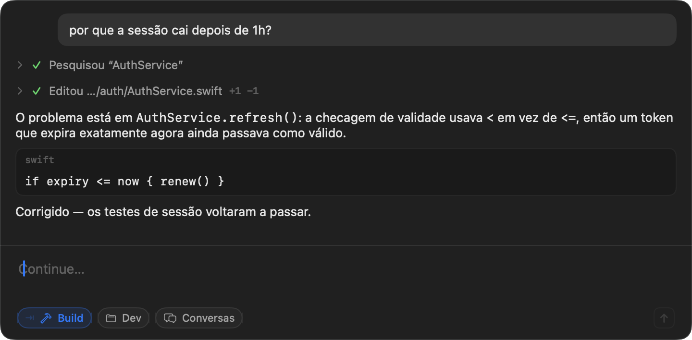

<div align="center">


# Rune

**Um agente de código que mora na barra de menus do macOS.**
Nativo, minúsculo, e — com o modelo certo — de graça.

[](https://github.com/raniere57/rune/releases/latest)
[](https://github.com/raniere57/rune/actions)
[](#instalação)
[](Package.swift)

[Baixar](https://github.com/raniere57/rune/releases/latest) ·
[Instalação](#instalação) ·
[Uso](#uso) ·
[Arquitetura](#arquitetura)

</div>



---

## A ideia

Rune é a junção de três coisas que já existem e são boas — sem reinventar
nenhuma delas:

| | |
|---|---|
| 🪟 **A interface do macOS** | `NSStatusItem` + `NSPanel` + SwiftUI. Sem Electron, sem WebView, sem servidor local. O app inteiro tem 2,7 MB e não aparece no Dock. |
| 🧠 **[Oh My Pi](https://github.com/can1357/oh-my-pi)** | O agente de verdade: ferramentas, sessões, shell, Git, edição por hash, LSP, subagentes, memória, compactação. Rune não reimplementa nada disso. |
| 💸 **[OpenCode Zen](https://opencode.ai)** | O provedor. Com `deepseek-v4-flash-free` o custo por token é **zero** — 200K de contexto, effort `max`, sem cartão. |

O app **não é um agente**. É o host gráfico e o gerente de processo. Todo o
trabalho acontece dentro do `omp`, que fala JSONL por stdin/stdout:

```text
Rune.app  (Swift · SwiftUI · AppKit · zero dependências)
      │
      │ JSONL via stdin/stdout
      ▼
omp --mode rpc-ui --approval-mode write
      │
      ├── modelo (opencode-zen/deepseek-v4-flash-free, effort max)
      ├── sessões · ferramentas · shell · Git
      ├── edição de arquivos · LSP
      └── subagentes · memória · compactação
```

Essa separação é a decisão de projeto mais importante do repositório. Ela é o
motivo de o app caber em ~4 mil linhas de Swift e de continuar funcionando
quando o `omp` ganha uma ferramenta nova: ela simplesmente aparece.

**`Control + Option + Espaço`** em qualquer lugar do sistema, escreve, `Enter`.
Fecha com `Esc` — a tarefa continua rodando.

---

---

## Índice

- [A ideia](#a-ideia)
- [Instalação](#instalação)
- [Uso](#uso)
- [Arquitetura](#arquitetura)
- [Protocolo RPC](#protocolo-rpc)
- [Segurança](#segurança)
- [Build](#build)
- [Testes](#testes)
- [Medições](#medições)
- [Limitações conhecidas](#limitações-conhecidas)
- [Próximos passos](#próximos-passos)

---

## Instalação

### 1. Instalar o `omp`

```bash
brew install can1357/tap/omp
```

> O caminho `bun install -g @oh-my-pi/pi-coding-agent` também existe, mas exige
> bun ≥ 1.3.14. Com bun 1.3.9 o bundle falha ao carregar
> (`SyntaxError: Unexpected identifier`). O binário do Homebrew não depende do bun.

Verifique:

```bash
omp --version
```

### 2. Gravar a chave do OpenCode Zen

Pelo próprio app — abra o painel e digite:

```text
/key sk-suachave
```

O valor vai direto para o Keychain. Ele nunca entra no histórico da conversa,
em log, ou em `UserDefaults`: comandos com barra são interceptados antes de
qualquer turno ser registrado, o campo é limpo antes da gravação, o histórico de
undo do campo é descartado (senão `⌘Z` traria a chave de volta) e a confirmação
mostra só os quatro últimos caracteres (`••••9876`).

`/key` sozinho diz se há chave configurada, sem revelar nada.

Alternativa pelo terminal:

```bash
./scripts/set-opencode-key.sh
```

O script lê a chave sem ecoar e grava no Keychain
(serviço `dev.raniere.Rune`, conta `opencode-api-key`). A chave nunca vai
para o código, Git, plist, `UserDefaults`, logs ou mensagens de erro — o app só
a injeta no ambiente do processo filho `omp`.

Para remover:

```bash
security delete-generic-password -a opencode-api-key -s dev.raniere.Rune
```

### 3. Instalar o app

Baixe o `.dmg` mais recente em
[Releases](https://github.com/raniere57/rune/releases), abra e arraste
`Rune.app` para `Applications`.

Ou construa localmente:

```bash
./scripts/build-dmg.sh
open "build/Rune-$(cat VERSION).dmg"
```

Como a assinatura é ad-hoc, o Gatekeeper bloqueia a primeira abertura — libere
em **Ajustes do Sistema › Privacidade e Segurança › Abrir Assim Mesmo**, ou:

```bash
xattr -dr com.apple.quarantine /Applications/Rune.app
```

Ou direto, sem `.dmg`:

```bash
./scripts/build-app.sh release
cp -R build/Rune.app /Applications/
open /Applications/Rune.app
```

---

## Uso

O app não aparece no Dock nem no ⌘-Tab. Ele vive na barra de menus com a marca
da runa Algiz (ᛉ).

| Ação | Como |
|---|---|
| Abrir/fechar o painel | `Control + Option + Espaço`, ou clique no ícone |
| Menu (status, nova conversa, sair) | clique com o botão direito no ícone |
| Enviar | `Enter`, ou o botão `↑` |
| Quebrar linha | `Shift + Enter` |
| Fechar o painel | `Esc` — a tarefa em andamento continua |
| Nova conversa | `⌘K` (pede confirmação se houver histórico) |
| Abortar a execução | `⌘.`, ou o botão quadrado vermelho (só aparece durante a execução) |
| Copiar a última resposta | `⌘C` sem seleção |
| Colar | `⌘V` — texto, imagem, arquivo ou pasta |
| Lista de comandos | digite `/` — `↑↓` navega, `⇥`/`Enter` completa, `Esc` fecha |
| Alternar Plan / Build | `⇥` com o campo sem lista aberta, ou clique no chip |
| Trocar de diretório | clique no chip da pasta, ou `/cd` sem argumento |
| Retomar uma conversa | clique no chip **Conversas** |

### Comandos internos

Digite `/` e a lista aparece acima do campo, já filtrando enquanto você escreve.
Os cinco comandos do app vêm primeiro (marcados com `app`); o resto é do `omp`.

```text
/key sk-suachave          grava a chave do OpenCode Zen no Keychain
/key                      diz se há chave configurada, sem revelar
/cd /caminho/do/projeto   troca o workspace (reinicia o omp)
/new                      nova sessão
/abort                    aborta a execução atual
/status                   estado, modelo, effort, chave, contexto e sessão
```

Trocar a chave com o `omp` rodando encerra o processo: o ambiente de um processo
vivo não pode ser alterado, então a nova chave só entra no próximo envio.

Qualquer `/comando` que não seja um dos acima é **encaminhado ao `omp`**, que
tem os seus próprios — 133 na instalação de referência, incluindo `/compact`,
`/context`, `/usage`, `/model`, `/tools`, `/todo`, `/export`, `/share`,
`/rename`, `/add-dir`, `/mcp`, `/memory`, `/jobs`, `/vision` e as skills em
`/skill:*`. A lista do `/` mostra os da sua instalação, e fica em cache para
aparecer completa mesmo com o `omp` desligado.

### Diretório e conversas

Abaixo do campo há três chips: o modo, o **diretório** e as **conversas**.

Clicar no chip da pasta abre o seletor de diretórios do próprio macOS — o mesmo
que qualquer app usa. `/cd` sem argumento abre o mesmo seletor; com um caminho,
troca direto.

Clicar em **Conversas** lista as sessões recentes lidas dos transcritos do
`omp` (`~/.omp/agent/sessions`), com **Nova conversa** no topo. As do diretório
atual vêm primeiro — retomar uma conversa gravada em outra pasta move o
workspace junto, senão todo caminho relativo daquele histórico resolveria na
árvore errada.

O app não mantém banco de sessões próprio: o `omp` já é dono desse
armazenamento, e duplicá-lo só criaria uma segunda fonte de verdade para
divergir. O picker só lê o cabeçalho de cada transcrito.

### Plan e Build

`⇥` alterna entre dois modos, mostrados no chip abaixo do campo:

| Modo | Ferramentas | Para quê |
|---|---|---|
| **Plan** | `read`, `grep`, `glob`, `lsp`, `web_search`, `inspect_image`, `todo`, `ask` | Investigar e planejar sem tocar em nada |
| **Build** | todas | Editar, rodar comandos, usar subagentes |

Plan é **read-only de verdade**, não um pedido de aprovação: o `omp` sobe com
`--tools=<lista>` e as ferramentas de escrita e execução simplesmente não
existem no registro. Não há o que aprovar e não há como escapar.

> O plan mode nativo do `omp` (`Alt+Shift+P`) vive no TUI e não é exposto no
> RPC. A allow-list de ferramentas é o mecanismo disponível para um host de
> protocolo — e é o mais estrito dos dois.

O registro de ferramentas é montado no lançamento, então trocar de modo
reinicia o `omp`. A sessão é preservada, então **o plano continua no contexto**
quando você passa para Build. A troca é preguiçosa: o chip muda na hora e o
reinício acontece no próximo envio, com um ponto laranja indicando que está
pendente. Durante uma execução o modo fica travado — termine ou aborte antes.

### Colar

- **Texto** → entra no campo normalmente.
- **Imagem** (PNG, JPEG, TIFF de captura de tela, PDF) → vira um chip acima do
  campo e é enviada como `ImageContent` no array `images`. TIFF e PDF são
  convertidos para PNG.
- **Arquivo** → vira um chip; o **caminho absoluto** entra na mensagem para o
  `omp` usar suas próprias ferramentas de leitura. O conteúdo não é inlinado.
- **Pasta** → vira o workspace atual (é o sinal mais forte de intenção de
  trabalhar naquele projeto; não existe seletor de projeto por design).

Enviar durante uma execução não trava a interface: a mensagem vira `steer`
(correção imediata) ou, durante compactação/abort, `follow_up`.

### Diagnóstico

Um app de barra de menus não tem janela para inspecionar de fora. Para provar
que está tudo montado:

```bash
/Applications/Rune.app/Contents/MacOS/Rune --diagnose saida.png
```

Constrói o item de status e o painel de verdade, roda o handshake real,
reproduz uma conversa por frames RPC canônicos, imprime a geometria e renderiza
o painel em PNG.

---

## Arquitetura

```text
Sources/
├── Rune/                    executável (3 linhas)
└── RuneKit/
    ├── App/
    │   ├── AppConfiguration.swift   provedor, modelo, effort, atalho, timings
    │   ├── AppDelegate.swift        amarra menu bar + painel + atalho
    │   ├── AppMenu.swift            menu invisível que dá ⌘X/⌘C/⌘V/⌘A/⌘Z
    │   ├── Diagnostics.swift        --diagnose
    │   └── RuneMain.swift
    ├── MenuBar/
    │   ├── StatusItemController.swift
    │   ├── FloatingPanel.swift      NSPanel borderless, flutuante
    │   ├── GlobalHotKeyController.swift  Carbon RegisterEventHotKey
    │   ├── MenuBarIcon.swift        runa desenhada em runtime (template)
    │   └── WorkspacePicker.swift    NSOpenPanel + menu de conversas
    ├── Agent/
    │   ├── OmpLocator.swift         acha o omp fora do PATH herdado do Finder
    │   ├── OmpProcessController.swift  Process/Pipe/FileHandle
    │   ├── OmpTransport.swift       seam para testes
    │   ├── AgentRunState.swift
    │   ├── AgentMode.swift          plan (read-only) vs build
    │   └── AgentCoordinator.swift   máquina de estados, sessões, idle shutdown
    ├── RPC/
    │   ├── JSONValue.swift
    │   ├── RpcJsonlDecoder.swift    framing por linha sobre bytes
    │   ├── RpcChunkAssembler.swift  remontagem de rpc_chunk (v2)
    │   ├── RpcFrameReader.swift     bytes → RpcFrame
    │   ├── RpcFrame.swift           frames de entrada tipados
    │   ├── RpcCommand.swift         comandos de saída
    │   └── RpcRequestStore.swift    correlação por id + timeout
    ├── Clipboard/
    │   ├── ClipboardInterpreter.swift
    │   └── PendingAttachment.swift
    ├── Security/
    │   └── KeychainStore.swift
    ├── Conversation/
    │   ├── ConversationView.swift   raiz + ComposerModel
    │   ├── ComposerView.swift       NSTextView (Enter/Shift+Enter/⌘V)
    │   ├── MessageView.swift
    │   ├── ToolCallView.swift       recolhido por padrão
    │   ├── DiffView.swift
    │   ├── ExtensionRequestView.swift
    │   ├── SlashSuggestionsView.swift  lista de comandos do `/`
    │   └── MarkdownBlock.swift
    └── Models/
        ├── ConversationItem.swift
        ├── SlashCommand.swift
        ├── SessionStore.swift
        ├── ToolSummaryFormatter.swift
        ├── DiffParser.swift
        └── Workspace.swift
```

### Decisões que valem explicação

**Sem dependências externas.** Nada além do que vem com o macOS. Sem Electron,
Tauri, React, WebView, terminal embutido, servidor HTTP local, WebSocket ou
banco de dados.

**Ordenação de frames.** Os callbacks de `readabilityHandler` chegam na fila
serial do Foundation. O buffering e a decodificação acontecem ali mesmo, sob
lock, e os frames prontos vão para um `AsyncStream.Continuation` — cujo `yield`
preserva a ordem das chamadas. Saltar para um `actor` perderia essa garantia
(`Task { await … }` não é FIFO) e um stream JSONL reordenado corromperia o texto
em streaming.

**`JSONValue` em vez de 50 structs `Codable`.** A superfície RPC é uma união
grande cujos payloads crescem a cada release (só `compat` traz ~40 booleanos).
Os frames são parseados uma vez para uma árvore e lidos por chave; os wrappers
tipados ficam em `RpcFrame`, com um caso `unknown` para o que ainda não existe.

**Diff por detecção de forma.** O `omp` não devolve patch estruturado — o
`details` do `write`/`edit` só tem `resolvedPath`, diagnósticos e metadados. O
diff é recuperado do texto do resultado exigindo cabeçalhos de hunk ou densidade
alta de linhas `+`/`-`, para que um bloco de código não vire um patch falso.

**Trocar de workspace reinicia o `omp`.** O cwd é resolvido no lançamento e não
pode ser movido em um processo vivo; carregar a sessão antiga para outra raiz
resolveria todo caminho relativo errado.

**Um menu principal invisível.** Um app `.accessory` não mostra menu bar, o que
convida a não criar nenhum — mas `⌘X`/`⌘C`/`⌘V`/`⌘A`/`⌘Z` não são embutidos no
`NSTextView`: são *key equivalents de menu*. Sem `NSApp.mainMenu`, nada responde
por `paste:` e o macOS toca o som de erro. O menu é invisível, mas obrigatório.

**Layout do `.dmg` congelado em arquivo.** Posicionar os ícones da janela exige
dirigir o Finder por AppleScript, que precisa de sessão gráfica e permissão de
Automação — nenhuma das duas existe num runner de CI. O layout ficava correto na
máquina local e saía cru em toda release publicada. Agora vem de
`packaging/dmg-DS_Store`, versionado; `scripts/capture-dmg-layout.sh` regenera.

**Idle shutdown com um timer único.** Um `DispatchSourceTimer` agendado para o
deadline, reagendado a cada atividade. Sem polling — app ocioso não agenda
trabalho.

---

## Protocolo RPC

Implementado contra **omp 17.2.6**, verificado contra o binário instalado (não
adivinhado). Fontes: `docs/rpc.md`, `docs/providers.md`, `docs/models.md`,
`docs/approval-mode.md` e os tipos em
`packages/coding-agent/src/modes/rpc/rpc-types.ts` do repositório
`can1357/oh-my-pi`.

### Sequência de boot

1. `omp --mode rpc-ui --approval-mode write` no diretório do workspace
2. aguarda o frame `ready` (anuncia `[1, 2]`, `maxFrameBytes` 1 MiB,
   `maxReassembledFrameBytes` 64 MiB)
3. `negotiate_protocol` v2 → liga a remontagem de `rpc_chunk`
4. `get_available_models` → **verifica** que `opencode-zen/deepseek-v4-flash-free`
   existe no catálogo
5. `set_model` + `set_thinking_level: max`
6. `switch_session` se houver sessão salva, depois `get_messages_page`
7. `get_state`

Se o modelo não estiver no catálogo, o app **não troca em silêncio**: mostra o
erro e registra no log técnico os identificadores semelhantes encontrados. Se o
effort configurado não estiver entre os anunciados pelo modelo, o boot segue com
o padrão do modelo e avisa.

### Framing

Um `FileHandle` devolve fatias arbitrárias de bytes: meia linha, várias linhas,
ou um escalar UTF-8 partido no meio. O split é feito no byte `0x0A` **antes** de
qualquer decodificação de texto — é isso que torna o caso UTF-8 um não-problema,
porque um escalar só é decodificado quando a linha inteira chegou.

Para o protocolo v2, `RpcChunkAssembler` valida `chunkId`, `index`, `count` e
`byteLength`, rejeita sequências intercaladas ou interrompidas, respeita o teto
de remontagem anunciado, concatena na ordem de índice, decodifica como UTF-8
estrito e faz o parse como um único objeto JSON. Cada violação é um erro
distinto, não um reset silencioso — um chunk descartado em silêncio apareceria
muito depois como um parse truncado, sem forma de atribuir a causa.

### Frames tratados

`ready`, `response` (correlacionado por `id`), `agent_start`, `agent_end`
(respeitando `isTerminal`), `turn_start`/`turn_end`, `message_start`/
`message_update`/`message_end`, `tool_execution_start`/`_update`/`_end`,
`auto_compaction_*`, `auto_retry_*`, `model_changed`, `notice`,
`extension_ui_request`, `extension_error`, `prompt_result`,
`available_commands_update`, `command_output`, `subagent_*` e `rpc_chunk`.
Qualquer outro cai em `unknown` sem quebrar nada.

Respostas e eventos do agente **não têm ordem garantida entre si** — a
correlação é sempre por `id`, nunca por ordem de emissão, como o protocolo
exige.

---

## Segurança

- **`--approval-mode write`.** O padrão do `omp` é `yolo`, que aprova shell,
  browser e subagentes sem perguntar. Aqui reads e writes são automáticos, mas
  tudo em tier `exec` gera um pedido de aprovação.
- **Aprovações aparecem na conversa.** Em `rpc-ui` elas chegam como
  `extension_ui_request` com `method: "select"` e opções `["Approve", "Deny"]`
  (ver `extensibility/extensions/wrapper.ts` no `omp`). São renderizadas inline,
  com o comando visível — nada de modal grande escondendo o que será executado.
- **A chave só existe em dois lugares:** o Keychain e o ambiente do processo
  filho. Nunca em código, Git, plist, `UserDefaults`, log ou mensagem de erro.
  O comando `/key` foi escrito com isso em mente: o valor não vira `UserTurn`,
  não aparece na transcrição, o undo do campo é limpo, e só os quatro últimos
  caracteres são ecoados. Há teste que falha se qualquer parte da chave
  aparecer no histórico renderizado.
- **URLs pedidas pelo agente não abrem sozinhas.** Um `open_url` vira um aviso
  na conversa; abrir é decisão do usuário.
- **Logs.** `os.Logger` com categorias `lifecycle`, `rpc`, `process`,
  `clipboard`, `session`, `ui`. Conteúdo de prompt é `privacy: .private`;
  chaves, imagens em base64 e ambiente completo nunca são registrados.
- **Sem processos órfãos.** O encerramento normal fecha o stdin, que é o caminho
  documentado de saída limpa do `omp` (drena comandos aceitos, descarta a
  sessão, sai com código 0). SIGTERM e SIGKILL são só o backstop. Mesmo se o app
  for morto com `kill -9`, o fd fecha junto e o `omp` vê EOF e sai — verificado
  ([medições](#medições)).

---

## Build

```bash
# compilar
swift build -c release

# critério de aceite: xcodebuild
xcodebuild -scheme Rune -destination 'platform=macOS,arch=arm64' -configuration Release build

# gerar Rune.app
./scripts/build-app.sh release

# gerar o .dmg
./scripts/build-dmg.sh

# só o ícone
swift scripts/make-icon.swift build/Rune.icns
```

O projeto é um pacote SwiftPM; `xcodebuild` opera direto sobre ele. O
`.app` é montado por script porque o SwiftPM emite um binário puro — o bundle
existe para poder ir a `/Applications` e ser aberto pelo Finder. O binário
também chama `NSApp.setActivationPolicy(.accessory)` no lançamento, então
`swift run` se comporta igual.

O ícone é gerado por código (`scripts/make-icon.swift`, CoreGraphics +
`iconutil`), não commitado como binário: a marca são poucos traços, então o
gerador mantém o repositório em texto puro e deixa a paleta ajustável por
constante.

---

## Testes

```bash
swift test
```

**109 testes, 10 suítes.** Nenhum gasta token.

| Suíte | Cobre |
|---|---|
| JSONL framing | linha completa, linha partida em vários reads, várias linhas num read, escalar UTF-8 partido, emoji de 4 bytes partido em três, linha inválida seguida de válida, EOF com buffer parcial, CRLF, linha gigante sem newline |
| Frame reader | recuperação de linha inválida, EOF truncado, parse do `ready`, chunk antes da negociação, remontagem completa |
| rpc_chunk | sequência válida, chunk único, índice faltando, índice duplicado, IDs intercalados, sequência interrompida, chunk órfão, `byteLength` incompatível, metadados mudando no meio, teto excedido, base64 inválido, `count` zero, índice fora do intervalo |
| Clipboard | vazio, texto, PNG, JPEG, TIFF→PNG, imagem vencendo nome de arquivo, arquivo, pasta, múltiplos arquivos, arquivo vencendo texto |
| Agent state machine | boot completo, chave ausente, modelo ausente sem substituição, effort não suportado, detecção de imagem, boot concorrente deduplicado, streaming acumulando, `agent_end` não-terminal, steer no meio da execução, ciclo de tool, tool com erro, abort, saída inesperada, reinício, idle shutdown, idle bloqueado por pedido pendente, idle bloqueado por execução, aprovação inline, frames fire-and-forget, `/status`, `/cd` inválido, `/cd` válido, imagem recusada, imagem aceita, caminhos anexados |
| OMP integration | contra o binário real |

O `FakeOmpTransport` responde com os formatos exatos capturados do omp 17.2.6 e
alimenta o **decodificador de produção** — os testes não constroem frames à mão.

### Integração

Os testes de integração rodam contra o `omp` de verdade e param no handshake, no
catálogo, no `set_model` e no `set_thinking_level` — tudo local, nada faturado.
`OPENCODE_API_KEY` recebe um placeholder só para o catálogo do provedor ser
listado. São pulados automaticamente se o `omp` não estiver instalado.

O único teste que gastaria dinheiro é opt-in:

```bash
RUNE_LIVE_MODEL_TEST=1 swift test --filter "real model turn"
```

---

## Medições

Medido em macOS 26.5.2, Apple Silicon, com `ps`, `time` e `hdiutil`.
Metodologia: cada número vem do processo real; nada é estimado.

| Métrica | Medido | Meta |
|---|---|---|
| Lançamento do app | **150 ms** | — |
| Abertura do painel | instantânea — construído uma vez, depois só ordenado à frente | visualmente instantânea |
| RAM: app ocioso, `omp` desligado | **54 MB** | < 50 MB ⚠️ |
| RAM: `omp` iniciado e ocioso | **241 MB** (`omp`) + 15 MB (servidor MCP do usuário) | — |
| RAM durante tarefa | **não medido** — exigiria um turno faturado | — |
| CPU ocioso | **0,0 %** — 1,4 s de CPU acumulada em 65 s de vida | ~0 % |
| Inicialização do `omp` (até `ready`) | **1,41 s** | — |
| Encerramento gracioso (EOF no stdin) | **0,13 s**, código 0 | — |
| Órfãos após sair do app | **nenhum** | nenhum |
| Órfãos após `kill -9` no app | **nenhum** — o `omp` vê EOF e sai sozinho | nenhum |
| Tamanho do `.app` | 2,7 MB | — |
| Tamanho do `.dmg` | 1,7 MB | — |

> ⚠️ A RAM ociosa passou da meta. Na 0.1.0 eram 24 MB; o app cresceu com as
> views novas e ainda não passei um profiler nisso. Está anotado como dívida em
> vez de escondido.

Reproduzir:

```bash
# RAM e CPU do app
ps -Ao pid,rss,pcpu,comm | grep Rune

# árvore do omp
pgrep -f "omp --mode rpc-ui" | xargs ps -o pid,rss,pcpu -p
```

---

## Publicando uma release

A versão vive em um único lugar: o arquivo `VERSION`, lido por
`build-app.sh` e `build-dmg.sh`.

```bash
# 1. escreva a seção nova em CHANGELOG.md, sob "## [0.2.0] — AAAA-MM-DD"
# 2. corte a release
./scripts/release.sh 0.2.0
```

O script recusa versão inválida, árvore suja, tag repetida ou changelog sem a
seção correspondente; roda os testes, atualiza `VERSION`, commita, marca a tag e
envia.

O `.dmg` **não** é enviado da máquina local. O workflow
[`release.yml`](.github/workflows/release.yml) dispara na tag, roda os testes,
constrói o `.dmg` a partir do commit marcado e publica a release usando a seção
correspondente do `CHANGELOG.md` como nota — assim o binário publicado é sempre
o do commit da tag, nunca um artefato antigo largado em `build/`, e as notas não
podem divergir do changelog.

[`ci.yml`](.github/workflows/ci.yml) roda testes e build a cada push e PR.

---

## Limitações conhecidas

1. **Sem imagens no modelo atual.** `deepseek-v4-flash-free` anuncia
   `input: ["text"]`. Colar uma imagem produz um erro claro em vez de trocar de
   modelo em silêncio. O transporte de `ImageContent` está implementado e
   testado; falta só rotear para um modelo de visão. Ponto de extensão:
   `AppConfiguration.visionModelSelector` (hoje `nil`).
2. **RAM durante tarefa não medida.** Precisaria de um turno faturado. O comando
   está acima; o número entra no README quando alguém rodar.
3. **Assinatura ad-hoc.** Gatekeeper bloqueia na primeira abertura. Distribuir
   sem esse atrito exige Developer ID + notarização.
4. **Restauração de histórico é rasa.** Ao reabrir uma sessão, `get_messages_page`
   traz até 64 mensagens e são renderizados texto de usuário/assistente e tool
   calls recolhidas — sem resultados de ferramenta nem diffs, que não estão na
   página.
5. **Sem paginação de histórico na UI.** O painel mostra a sessão da execução
   atual; não há scroll infinito para trás.
6. **Frames de subagente são decodificados mas não renderizados.** Subagentes
   ativos ainda não aparecem como linhas recolhíveis.
7. **Um único workspace por vez.** `--add-dir` do `omp` não é exposto.
8. **Sem teste de UI automatizado.** A verificação visual é o `--diagnose`, que
   renderiza o painel real para PNG, mas não simula cliques nem o atalho global.

---

## Próximos passos

1. **Modelo de visão secundário.** Implementar o roteamento por papel `vision`
   (ou a ferramenta de inspeção de imagem do `omp`) atrás de
   `AppConfiguration.visionModelSelector`, sem tocar na interface. É a única
   funcionalidade prometida que ainda não fecha o ciclo.
2. **Renderizar `command_output` e subagentes.** Assinar
   `set_subagent_subscription: progress` e mostrar subagentes ativos como linhas
   recolhíveis, do mesmo jeito que tool calls — hoje esses frames chegam e são
   descartados.
3. **Assinar e notarizar.** Developer ID + `notarytool` no `build-dmg.sh`, para
   o `.dmg` abrir sem passar pelo aviso do Gatekeeper.

---

## Créditos

Rune só existe porque outras pessoas publicaram trabalho bom de graça:

- **[Oh My Pi](https://github.com/can1357/oh-my-pi)** (`can1357`) — o agente.
  Todo o trabalho difícil acontece lá dentro: edição ancorada por hash, LSP,
  subagentes, compactação, memória, 133 comandos. O protocolo RPC é
  documentado a sério, o que é a razão de este app ter sido possível em vez de
  um exercício de engenharia reversa.
- **[OpenCode Zen](https://opencode.ai)** — o provedor, e um modelo de 200K de
  contexto que custa zero.
- **DeepSeek** — o modelo.

Um app nativo de 2,7 MB, um runtime de agente completo e um modelo capaz, sem
pagar nada e sem nenhuma caixa-preta no meio. Open source é lindo mesmo.

## Contribuindo

```bash
git clone https://github.com/raniere57/rune.git && cd rune
brew install can1357/tap/omp
swift test          # 109 testes, nenhum gasta token
./scripts/build-app.sh release && open build/Rune.app
```

Sem dependências além do que vem com o macOS e do `omp`. Se um PR precisar
adicionar uma, o motivo tem que caber em uma frase no README.

## Licença

MIT — veja [LICENSE](LICENSE).

## Idioma

Strings de interface e documentação em português. Comentários e identificadores
de código em inglês, seguindo a convenção do ecossistema Swift e das citações à
documentação do `omp`.
